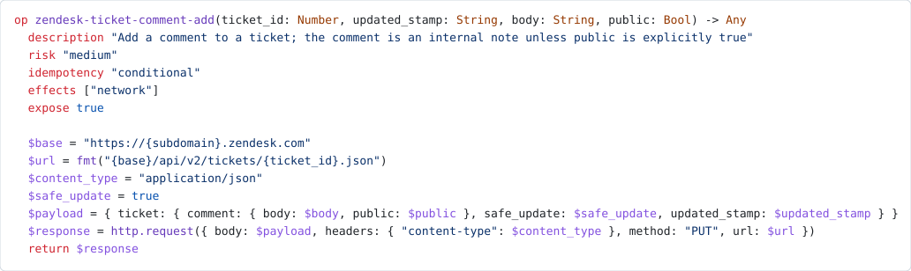

<p align="center">
  
</p>

# flux-connectors

Compile SaaS API descriptions into [Flux-Lang](https://github.com/codewandler/flux). A connector
declares what a vendor can do in **both directions** — the operations flux calls, and the events the
vendor sends back — and what an **operator** must supply to use it: credentials, configuration, and the
one read that proves the connection works. Out come typed Flux operations, capability manifests, a
queryable Rust catalogue, and a flux Tool pack.

> [!WARNING]
> **v0.23.0 is a compiler, a catalogue and a Tool pack.** None of the published crates opens a socket;
> the pack authenticates and dispatches through an `http.request` its caller supplies. The one host in
> this repository is `crates/connectors-api` — `publish = false`, loopback-only, and the thing that has
> actually sent bytes to a vendor. See [Current limitations](#current-limitations).

The repository currently contains **835 curated connector operations across 55 providers and 68
services**, plus 53 events and 5 channel bindings. It also publishes 77 Flux-owned core operations, node
kinds and capability records, and 3 core JSON Schemas. A full build compiles everything into **1169
committed, reviewable artifacts** without contacting a vendor — including one canonical
`catalog/<name>.catalog.json` document per provider, the reviewed artifact of Decision 0022, and the
one `catalog.pack` file those documents compile into, served by the dependency-free
`codewandler-connector-catalog-reader` crate (C-537). Browse
them in the [catalogue explorer](https://flux.codewandler.org/explorer).

> These counts are intentionally mutable, but they are checked against a full build plan by
> `crates/connector-cli/tests/readme_snippet.rs`. When the catalogue changes, regenerate the stated
> numbers in this file and `AGENTS.md`; do not relax the check.

## Why this exists

A SaaS integration usually repeats information the vendor has already published: a base URL, an
authentication scheme, endpoints, parameters, and response shapes. flux-connectors makes that
information compiler input. The small provider definition records the curated surface and its
quirks; the compiler produces the Flux that actually runs.

Generated HTTP connectors to services such as Zendesk, Salesforce, and OpenAI are the complete path
today. The destination is broader: every official integration, including Docker, Kubernetes, SQL,
Prometheus, and other protocol-rich systems, is declared and distributed as a connector. A connector
may select a guarded socket, process, container, database, remote, or plugin runtime instead of HTTP;
Exchange executes it under tenant-derived authority and Flux reaches it through its embedded
Exchange client. That migration is tracked by
[C-495](docs/stories/C-495-all-integrations-are-connectors-epic.md); the current native Flux plugins
remain compatibility paths only until their replacements pass frozen Exchange conformance and
incremental cutover gates.

## What the compiler produces

Describe a provider once in `providers/<name>.toml`. `flux-connectors build` writes:

| Output | Purpose |
|---|---|
| `catalog/<name>.catalog.json` | The canonical per-provider document (Decision 0022): the complete surface, request templates included. |
| `catalog/connector-document.schema.json` | The versioned JSON Schema every document is validated against at build time. |
| `crates/catalog-reader/catalog.pack` | The whole catalogue's documents in one offset-indexed, digest-carrying file (C-537). |
| `connectors/<name>.flux` | The provider's typed Flux `op` declarations. |
| `connectors/<name>.connector.toml` | The host-facing capability and credential manifest. |
| `crates/catalog/ops/<name>/*.flux` | One standalone rendering per operation. |
| `crates/catalog/src/generated/<name>.rs` | Static metadata embedded by `connector-catalog`. |
| `web/public/catalog.json` | The generated data behind the public operation explorer. |
| `web/public/v1/**/*.json` | Dereferenceable Flux core entries and JSON Schemas. |

Generated Flux is built as real `flux_lang` AST nodes and formatted by flux-lang's formatter—never
assembled with string templates. Generated artifacts are committed so changes arrive as ordinary,
reviewable diffs.

This table is the delivered state, not the destination. flux-roadmap **Decision 0022** (2026-08-12,
adopted by [C-535](docs/stories/C-535-adopt-decision-0022.md)) makes the compiled form of a
connector a versioned **catalog artifact**: one canonical committed document per provider, compiled
into a single pack the resolver reads, with the emitted `.flux` modules retiring only after a
differential gate proves the document-derived requests byte-identical to the Flux-derived ones.
That program is [C-534](docs/stories/C-534-catalog-artifact-epic.md) (C-536…C-541); C-536 shipped
the canonical document and C-537 the pack and its dependency-free reader, both additively, so every
other artifact above is unchanged; only the resolver and the retirement are ahead. See
[docs/designs/catalog-artifact.md](docs/designs/catalog-artifact.md).

## Try it locally

You need Rust 1.87 or newer. From the repository root:

```bash
# Confirm the committed artifacts match their inputs; this does not write files.
cargo run -p connector-cli -- diff

# Regenerate all artifacts. This is hermetic and offline.
cargo run -p connector-cli -- build
```

On a clean checkout, `diff` reports:

```text
1169 artifacts up to date (55 providers checked)
```

Then inspect [`connectors/zendesk.flux`](connectors/zendesk.flux), browse the
[catalogue explorer](https://flux.codewandler.org/explorer), or query the embedded
catalogue from Rust:

```bash
cargo add codewandler-connector-catalog
```

```rust
use catalog::{OperationKey, Risk};

let op = catalog::operation(OperationKey::id("zendesk-ticket-show")).unwrap();
assert_eq!(op.risk, Risk::Low);
println!("{}", op.flux);
```

The crate contains static data only: no filesystem access, initialization or runtime. Its one
dependency is the data-only `catalog-reader`, which carries the pack and resolves nothing.

If you have no Rust toolchain and no clone, take the pack from the release instead. Every tag
attaches it beside a one-line checksum, so a consumer verifies before parsing:

```bash
base=https://github.com/codewandler/flux-connectors/releases/download/v0.23.0
curl -fsSLO "$base/catalog.pack" -O "$base/catalog.pack.sha256"
sha256sum -c catalog.pack.sha256   # catalog.pack: OK
```

That single file is the whole catalogue — every provider's canonical document, offset-indexed —
readable with `catalog_reader::Pack::load` or by any implementation of the container format.

### CLI status

| Command | Status |
|---|---|
| `build` | Implemented; regenerates committed artifacts offline. |
| `diff` | Implemented; reports what `build` would change without writing. |
| `check` | Planned in C-14; currently exits with an error. |
| `fetch` | Planned in C-14; currently exits with an error. |
| `install` | Superseded by Decision 0022 — C-15 is closed and no module installer is coming; currently exits with an error. |

## An example of generated Flux

<picture>
  <source media="(prefers-color-scheme: dark)" srcset="assets/readme-snippet-dark.svg">
  
</picture>

<details>
<summary>Same operation as copy-pasteable text</summary>

```flux
op zendesk-ticket-update(ticket_id: Number, ticket: Any) -> Any
  description "Update Ticket"
  risk "medium"
  idempotency "non_idempotent"
  effects ["write", "network"]
  expose true

  base = "https://{subdomain}.zendesk.com"
  url = fmt("{base}/api/v2/tickets/{ticket_id}")
  content_type = "application/json"
  payload = { ticket }
  response = http.request(body: payload, headers: { "content-type": content_type }, method: "PUT", url)
  return response
```

</details>

## Design in one screen

**TOML is compiler input; behaviour is Flux; the compiled form is becoming data.** Connector
behavior — control flow, retry and throttle, sagas, approval gates — belongs in Flux-Lang, which
already has a parser, analyzer and formatter, instead of in a second configuration language.
Request shaping, by contrast, is closed declarative data a resolver evaluates: Decision 0022 makes
that the compile destination, and today it still ships as emitted Flux that the pack parses back.

**The vendor spec is the source of truth; drift is detected, not silently absorbed.** Artifacts
record the hashes that produced them. Once C-14 lands, `flux-connectors check` will use that
provenance to detect upstream movement.

**Secrets never enter compiler inputs or generated source.** Provider TOML, generated `.flux`, and
the lockfile carry credential references only. The host is responsible for resolving credentials,
applying their scheme, and registering secret values with its redactor.

## Current limitations

These are stated plainly because a connector that merely looks executable is worse than one that
fails closed:

- **A generated provider cannot make a live call *as Flux*, and never will.** `connectors/*.flux` is
  unauthenticated: `$auth` was taken off the critical path rather than landed, so the module path has
  no way to name a credential. Decision 0022 closed that path permanently rather than eventually —
  the module seam ([C-10](docs/stories/C-10-auth-injection-and-manifest.md)) and the installer
  ([C-15](docs/stories/C-15-install-and-live-e2e.md)) are superseded, and the `.flux` artifacts
  themselves retire under [C-534](docs/stories/C-534-catalog-artifact-epic.md)'s differential gate.
  What closed instead is the *host* path — `connector-pack` assembles auth in Rust (the
  `Bearer ` prefix, the base64-joined Basic pair, query placement) and registers the value with flux's
  redactor before building the request, and `crates/connectors-api` binds that to a real
  `http.request` from `codewandler-flux-web`. This repository has sent real bytes to a real vendor;
  the exchange is recorded in `crates/connectors-api/README.md`.
- **One declarable surface still reaches no artifact: `graphs`.** It is modelled in the IR,
  nothing declares one, and the canonical document refuses rather than drops it while its lowering
  is an open question of the catalog-artifact design. A service's `roles` and `quirks.pagination`
  left this list with C-536 — both now reach `catalog/<name>.catalog.json` — and
  `quirks.rate_limit` became representable there (the document schema carries the field; nothing
  declares one yet, so no document does). The pack and its reader (C-537) now ship every document
  whole; nothing *interprets* those fields until the resolver lands (C-538). `config`
  and `verify` left it earlier: C-87 published both, and today 85 config fields across 42 providers
  travel identically into `web/public/catalog.json` and into 67 `connectors/*.connector.toml`
  manifests (more manifests than providers because a multi-service connector emits one per
  service), alongside `verify` on 43 of them. A host can now render a settings page and find the
  "Test connection" operation from the artifact alone.
- **Freshdesk ships with no credential at all**, deliberately. Its `base64(<api_key>:X)` places the
  secret in a position the current IR cannot mark as secret. Emitting it would bypass secret gating
  and redaction, so the connector fails closed with a 401 instead.
- **Form request bodies still lack percent-encoding.** C-30 closed the query half with Flux 0.54's
  structured `http.request(query: ...)` field, but form bodies are still assembled as text. A value
  containing `&` or `=` can reshape that body, so operations needing unconstrained form values stay
  out until the runtime's form encoder is available. See
  [docs/designs/query-encoding.md](docs/designs/query-encoding.md).
- **Base URLs can contain template variables**, such as `https://{subdomain}.zendesk.com`. A connector
  binds each one with a `[[config]]` field, and since C-87 that binding reaches the manifest and the
  catalogue, so a host can discover what to ask for.
- **OpenAPI ingest is partly wired.** 47 of the 55 providers are hand-authored; 8 are `[spec]`-backed
  against a vendored, hash-pinned vendor document — `asterisk`, `babelforce`, `github`,
  `microsoft_graph`, `openai`, `stripe`, `twilio` and `zendesk`. `specs/` vendors those documents
  beside flux's own core catalogue, each with a provenance record naming the upstream URL and hash
  (`specs/<vendor>.provenance.toml`, or `specs/asterisk/provenance.toml` for the one whose upstream
  is a directory). What remains unwired is the *fetch* half: `specs/` is refreshed by the scripts in
  `scripts/`, never by the build, which still reaches no network.
- **`check`, `fetch`, and `install` are not implemented.** Their CLI entries fail explicitly and
  point to their owning stories.

## Contributing

The workspace requires:

```bash
cargo build --workspace
cargo nextest run --workspace --no-fail-fast
cargo test --workspace --doc
cargo clippy --workspace --all-targets -- -D warnings
cargo fmt --all --check
```

The test suite runs through [cargo-nextest](https://nexte.st), which executes each test in its own
process across every core rather than one test binary at a time. Install it once:
`cargo install cargo-nextest --locked --version 0.9.143`. nextest runs no doc-tests, so
`cargo test --workspace --doc` stays in the gate beside it.

The documentation site is a separate Node 22+ build and does not participate in the Cargo
workspace:

```bash
cd web
npm ci
npm run build
npm test
```

Agents and automation must read the repository's [operating contract](AGENTS.md) before changing
anything. Human contributors can use the same [status board](docs/stories/README.md) and story
workflow.

## Repository map

| Path | Role |
|---|---|
| `crates/connector-spec` | Connector IR, provider loading, validation, and lockfile. No network IO. |
| `crates/connector-flux` | Flux emission through `flux_lang`'s AST and formatter. |
| `crates/connector-cli` | Filesystem and future network orchestration for the `flux-connectors` binary. |
| `crates/catalog` | `connector-catalog`, with every operation embedded at compile time. Data plus lookups over it; its one dependency is `catalog-reader`. |
| `crates/catalog-reader` | Dependency-free reader for `catalog.pack` — the whole catalogue's canonical documents in one verifiable file. Resolves nothing. |
| `crates/connector-pack` | Host library: projects catalogue operations onto flux `ToolSpec`s and installs them as a Tool pack. Assembles auth; opens no socket. |
| `crates/connector-secrets` | Host library: resolves a credential *address* to a *value*. `SecretStore`, generation-fenced recoverable prepared transactions in memory or an owner-only leased file, and an optional Vault KV v2 client. Unreachable from the compiler, by test. |
| `providers/` | Hand-authored provider definitions. |
| `connectors/` | The generated Flux modules and capability manifests. |
| `specs/` | Vendored spec cache used by offline builds: vendor documents beside flux's own core catalogue, each hash-pinned by a provenance record. |
| `docs/` | Vision, roadmap, designs, and the story board. |
| `web/` | The public VitePress documentation and operation explorer. |

More detail:

| If you want… | Read… |
|---|---|
| Why the project exists | [docs/vision.md](docs/vision.md) |
| How to integrate this into a flux host | [docs/integrating-with-flux.md](docs/integrating-with-flux.md) |
| What ships next | [docs/roadmap.md](docs/roadmap.md) |
| How a provider becomes Flux | [docs/designs/connector-pipeline.md](docs/designs/connector-pipeline.md) |
| The credential model | [docs/designs/unified-auth.md](docs/designs/unified-auth.md) |
| Current work and story status | [docs/stories/README.md](docs/stories/README.md) |
| Site development and deployment | [web/README.md](web/README.md) |

## Licence

Dual-licensed under [MIT](LICENSE-MIT) or [Apache-2.0](LICENSE-APACHE), at your option.
